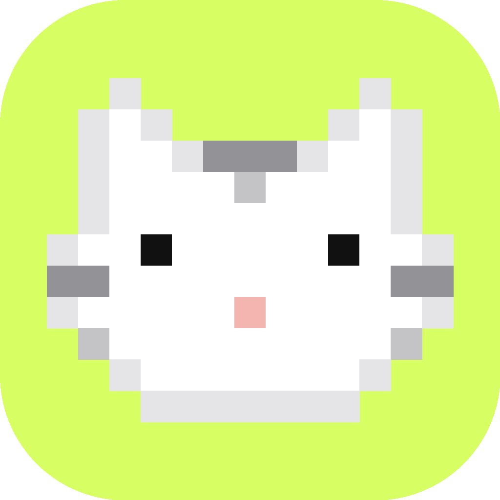

<div align="center">



# Code Light

**Control Claude Code from your iPhone — with native performance, precise terminal targeting, and Dynamic Island.**

[English](README.md) · [简体中文](README.zh-CN.md)

[](https://github.com/xmqywx/CodeLight/stargazers)
[](LICENSE)
[](https://github.com/xmqywx/CodeLight/releases)
[](https://swift.org)

</div>

---

Code Light is a **native iPhone companion** for Claude Code. It pairs with [CodeIsland](https://github.com/xmqywx/CodeIsland) on your Mac and lets you read, send, and orchestrate your AI coding sessions from anywhere — without touching the keyboard.

This is a **passion project**, purely for personal interest. It is **free and open-source** with no commercial agenda. Bugs, PRs and ideas are welcome.

---

## Why Code Light?

> *"I already have [Happy](https://github.com/slopus/happy) — why would I use this?"*

Short answer: because Code Light is built from the ground up for Claude Code + Mac + cmux, and it leans hard into native iOS. Every design decision picked correctness and feel over cross-platform breadth.

<table>
<tr><td width="50%">

### 🎯 Pinpoint terminal routing
Your message lands in the **exact** Claude pane you picked — not "the first Claude window I could find". Code Light walks `ps -Ax` to find the `claude --session-id <uuid>` PID, reads `CMUX_WORKSPACE_ID` / `CMUX_SURFACE_ID` from that process's env, then issues a single `cmux send --workspace <ws> --surface <surf>`. Zero heuristics, zero cwd fuzzy-matching, zero chance of hitting the wrong window.

</td><td width="50%">

### 🏝️ Dynamic Island, done right
A **single global Live Activity** reflects "whatever Claude is doing right now". Phase transitions (`thinking → tool_running → waiting_approval`) drive updates via APNs. Long assistant replies do not flicker the island. One activity scales to N sessions without hitting iOS Live Activity caps.

</td></tr>
<tr><td>

### ⚡ Any slash command, any time
Type `/model opus`, `/cost`, `/usage`, `/clear`, `/compact` — **any** Claude slash command works from the phone. Code Light snapshots the terminal, injects the command, waits for output to settle, diffs the panes, and ships the captured output back as a synthetic `terminal_output` message. You see the response even though slash commands never hit Claude's JSONL.

</td><td>

### 🖥️ One iPhone, N Macs
Pair your phone with multiple Macs and switch between them with a tap. Each Mac has a **permanent 6-character pairing code** that never rotates — no QR expiry, no "wait for the handshake", just "A7K2M9, go". Each Mac can live on a different backend server entirely. Sessions are strictly isolated per Mac.

</td></tr>
<tr><td>

### 🚀 Remote session launching
Tap `+` on your iPhone, pick a **launch preset** (`claude --dangerously-skip-permissions --chrome`), pick a project path — and watch a brand-new cmux workspace spawn on your Mac running that exact command. Presets live on the Mac so you control the allowlist. Recent project paths sync automatically.

</td><td>

### 📷 Real iOS integration
Native SwiftUI, not a webview. Native Ed25519 via CryptoKit. Native `PhotosPicker` + `UIImagePickerController` for attachments (take photos with the camera, not just pick from library). Native haptics throughout — pair success is a satisfying double-tap, launch is a rigid click, destructive actions warn-buzz before confirmation.

</td></tr>
</table>

---

## Code Light vs Happy — honest comparison

Both apps let you talk to Claude Code from your phone. Here's where they actually differ:

| Capability | Code Light | Happy |
|---|:---:|:---:|
| **Dynamic Island** (real one, not a notification) | ✅ Global phase-driven activity | ❌ |
| **Multi-Mac pairing** (one iPhone ↔ many Macs) | ✅ Permanent short codes | ❌ One device at a time |
| **Multi-backend-server** (Macs on different servers) | ✅ Flat list, auto switch | ❌ |
| **Precise cmux surface targeting** | ✅ UUID → PID → env vars | ❌ No terminal routing |
| **Any Claude slash command** (`/model`, `/cost`, `/usage`, …) | ✅ Captured output returned | ❌ Only text messages |
| **Remote session launch** (spawn new cmux pane from phone) | ✅ With Mac-defined presets | ❌ |
| **Binary-efficient transport** | ✅ Plain text + Socket.io frames | ❌ Base64-wrapped payloads |
| **Native Swift iOS app** | ✅ SwiftUI + ActivityKit | ❌ React Native / Expo |
| **Rich markdown rendering** (code, tables, lists, headings) | ✅ Custom SwiftUI renderer | ⚠️ Basic |
| **Terminal control keys** (Esc, Ctrl+C, Enter) | ✅ Dedicated buttons + swipe | ❌ |
| **Image attachments** (camera + library) | ✅ Both | ⚠️ Library only |
| **Permanent pairing code** (type instead of scan) | ✅ 6 chars, never rotates | ❌ QR only |
| **In-app privacy policy** (Apple-compliant) | ✅ Bilingual | ⚠️ External link |
| **Full EN/ZH localization** | ✅ Including Info.plist | ⚠️ |
| **Self-hostable** | ✅ | ✅ |
| **Open source** | ✅ MIT | ✅ |

### Deep dive — why each of these matters

**1. Terminal routing: no guessing game.**
Happy has no concept of which cmux pane a message should go to. It can't, because it wraps your CLI (`happy claude` instead of `claude`) and only sees its own stdin/stdout. Code Light does the opposite: CodeIsland on the Mac watches the whole system — it knows every Claude process, every cmux surface, and the mapping between them via `CMUX_WORKSPACE_ID`/`CMUX_SURFACE_ID` env vars. A message targeted at session UUID `abc12345…` lands in exactly that pane. If the process is gone, the message is cleanly dropped instead of hijacking a nearby window.

**2. Binary transport, not base64.**
Happy's wire format wraps payloads in base64 (`Buffer.from(...).toString('base64')` shows up all over their session routes). Base64 inflates every byte by 33% and requires an extra encode/decode round-trip on both sides. Code Light sends message content as plain UTF-8 strings over Socket.io frames — smaller, faster, less code. Images are uploaded as raw binary via `POST /v1/blobs` and referenced by opaque IDs, never base64-blobbed into messages.

**3. Real Dynamic Island, not a nudge.**
Code Light runs an ActivityKit Live Activity that reflects Claude's current phase in your iPhone's Dynamic Island — not a push notification that disappears after 3 seconds. The activity updates in place as Claude moves between states, shows the active tool name, and collapses gracefully when all sessions finish. This is only possible because Code Light is a native Swift app. React Native can't do ActivityKit cleanly.

**4. Slash commands round-trip.**
`/model`, `/cost`, `/usage`, `/clear` etc. don't fire Claude's hook events — they're handled inside the CLI and their output never reaches the JSONL. Most remote clients therefore can't see the response. Code Light's CodeIsland bridge solves this by: snapshot the pane before injection, send the command, poll until output settles, diff the snapshots, ship the new lines back as a synthetic `terminal_output` message. From the phone it looks like any other response.

**5. Multi-Mac really means multi-Mac.**
Pair your phone with `MacBook Pro` and `Mac mini`, on two different servers if you want. Code Light shows both Macs in one list, grouped by server host, current connection marked green. Tap a Mac on a different server and Code Light reconnects in the background. Every Mac gets its own permanent 6-char `shortCode` (never expires) so pairing additional iPhones is just "type the code". Session access is strictly scoped per `DeviceLink` in the server DB — Mac A's sessions are invisible to an iPhone paired only with Mac B.

**6. Remote launch closes the loop.**
From the phone, tap `+`, pick a preset like `Claude (skip perms) + Chrome`, pick a project from recent paths, tap Launch — Code Light sends `POST /v1/sessions/launch`, the server emits a `session-launch` socket event scoped to your Mac's `deviceId`, CodeIsland's `LaunchService` spawns `cmux new-workspace --cwd <path> --command "<command>"`, and a fresh cmux workspace pops up running Claude. You never touched your keyboard. Presets are defined on the Mac (so you control the command whitelist), project paths sync from live session cwds.

---

## Features

### 📱 Real-time session sync
Every message, tool call, and thinking block streams to your phone as it happens. Lazy-loaded history (50 per page, `before_seq` cursor for scrollback), delta sync on reconnect.

### 🏝️ Dynamic Island
A global Live Activity with six states (thinking, tool running, waiting approval, writing, done, idle). Pixel-cat animation on the Mac matches the phone's state.

### 💬 Send messages + control keys
Text input, send with one tap. Dedicated buttons for Escape and Ctrl+C. All messages go straight to the target cmux pane via surface-ID routing.

### ⚡ Any slash command, with captured output
`/model`, `/cost`, `/usage`, `/clear`, `/compact`, `/help` — anything. Output is diffed from the terminal pane and shown in your chat view as a `terminal_output` bubble.

### 🖼️ Image attachments
Attach photos via `PhotosPicker` or capture a new one with the camera. Up to 6 per message, JPEG-compressed locally, uploaded as blobs, pasted into the cmux pane on the Mac via `NSPasteboard` + AppleScript `Cmd+V`.

### 🔐 Short-code pairing (and QR)
Each Mac's CodeIsland menu shows a permanent 6-character code and a QR. On the iPhone, scan the QR or type the code — either way triggers the same `/v1/pairing/code/redeem` endpoint. Multi-Mac: pair more by typing more codes. No accounts, no passwords, no re-pair after reboot.

### 🖥️ Multi-Mac, multi-server
Maintain a flat list of paired Macs across any number of backend servers. Tap to switch active connection. Each Mac carries its own `serverUrl` in local state.

### 🚀 Remote session launch
Launch presets are defined on the Mac (name, command, icon, sort order). The phone fetches them, shows them in a sheet, and triggers cmux to create a new workspace with the chosen command and project path.

### 🔔 Granular push notifications
Per-device toggles: notify on completion, on tool approval wait, on error. APNs-delivered, Live Activity push via HTTP/2.

### 🌍 Full bilingual UX
English and 简体中文 everywhere — UI strings (`Localizable.xcstrings`), permission prompts (`InfoPlist.xcstrings`), and privacy policy. iOS auto-selects based on system language.

### 🎛️ Haptic feedback throughout
Carefully chosen feedback for every class of interaction: selection for tab/picker, light for navigation, medium for buttons, rigid for commits, success for pair/launch, warning before destructive actions, error for failures.

---

## Architecture

```
  Mac (CodeIsland)              Backend (self-hosted)         iPhone (Code Light)
┌──────────────────┐         ┌──────────────────────┐      ┌────────────────────────┐
│ Claude Code      │         │ Fastify + Socket.io  │      │ 📱 Linked Macs list    │
│ hooks + JSONL    │         │ PostgreSQL + Prisma  │      │ 💬 Chat + markdown     │
│                  │         │                      │      │ 🏝️ Dynamic Island     │
│ CodeIsland       │◀───────▶│ DeviceLink graph     │◀────▶│ ⌨️ Send + control keys │
│  · SessionStore  │ WebSocket│ Zero-knowledge relay │ WSS  │ 📷 Camera + photos     │
│  · LaunchService │  + HTTPS │ APNs bridge (HTTP/2) │      │ 🚀 Remote launch       │
│  · PresetStore   │         │                      │      │ 🔔 Push notifications  │
└──────────────────┘         └──────────────────────┘      └────────────────────────┘
       cmux bridge                                                  ActivityKit
       (workspace + surface env vars)                               WidgetKit
```

Strict per-device isolation via `DeviceLink` in the server DB. An iPhone paired only with Mac A cannot see Mac B's sessions, presets, projects, or launch endpoints.

---

## Requirements

- **Mac**: macOS 14+, [CodeIsland](https://github.com/xmqywx/CodeIsland) installed, [cmux](https://cmux.io) for terminal integration
- **iPhone**: iOS 17+
- **Server**: any host with Node.js 20+ and PostgreSQL 14+ (or use a public CodeLight Server)

---

## Quick Start

### 1. Deploy the server

```bash
git clone https://github.com/xmqywx/CodeLight.git
cd CodeLight/server
npm install
cp .env.example .env
# Set DATABASE_URL, MASTER_SECRET (64-char hex), PORT
npx prisma db push
npm start
```

Put Nginx in front with TLS. `pm2 start npm --name codelight-server -- start` for production.

### 2. Install CodeIsland on your Mac

Follow the [CodeIsland README](https://github.com/xmqywx/CodeIsland). Its Sync module will auto-register this Mac with your server and lazy-allocate a permanent 6-character pairing code.

### 3. Build the iPhone app

```bash
cd CodeLight/app
open CodeLight.xcodeproj
```

Select your development team → connect your iPhone → press **⌘R**.

### 4. Pair

1. On your Mac, open CodeIsland's notch menu → **Pair iPhone**. You'll see a QR and a 6-char code.
2. On your iPhone, enter your server URL and the code (or scan the QR).
3. Done. The Mac appears in the "Macs" list. Tap in to see its sessions.

---

## Security & privacy

| Layer | How |
|---|---|
| **Identity** | Ed25519 keypair (CryptoKit), per-device, never exported |
| **Storage** | iOS/macOS Keychain |
| **Transport** | TLS 1.2+ (HTTPS + WSS) |
| **Pairing** | Per-Mac permanent 6-char shortCode, unique server-side |
| **Access control** | `DeviceLink` graph — every request checks `getAccessibleDeviceIds()` |
| **Messages** | E2E-encryption-ready (CryptoKit ChaChaPoly), zero-knowledge relay |
| **Data collection** | None. No analytics. No telemetry. No third parties |

See [Privacy Policy](PRIVACY.md). The policy is also viewable inside the iPhone app without a network connection (Apple App Store requirement).

---

## Project structure

```
CodeLight/
├── server/              # Fastify + Socket.io + Prisma backend
├── app/
│   ├── CodeLight/       # Main iPhone app (SwiftUI)
│   └── CodeLightWidget/ # Dynamic Island / Lock Screen widget
├── packages/
│   ├── CodeLightProtocol/   # Shared DTOs (Codable)
│   ├── CodeLightCrypto/     # Ed25519 + ChaChaPoly
│   └── CodeLightSocket/     # Socket.io Swift wrapper
└── docs/specs/          # Design docs (multi-mac pairing, etc.)
```

---

## Engineering highlights

A handful of non-obvious design decisions that make the system feel solid in practice.

### Precise phone → terminal routing
Two facts the system already knows:
1. Claude Code is invoked with `--session-id <UUID>` on argv (`ps -Ax`)
2. cmux exports `CMUX_WORKSPACE_ID` / `CMUX_SURFACE_ID` into every pane (`ps -E -p <pid>`)

Pipeline: `ps` → PID → env vars → `cmux send --workspace <ws> --surface <surf>`. No title matching, no cwd heuristics. Orphan processes are cleanly dropped.

### Single global Live Activity
Running one activity per session made the Dynamic Island stretch/collapse as sessions came and went, and hit iOS concurrent-activity caps. Code Light runs **one** global activity whose `ContentState` carries `activeSessionId`, `activeSessions`, `totalSessions`, latest phase. Whoever had the most recent phase change owns the island. Switching context is a state update, not a lifecycle cycle.

### Phase messages as the activity pulse
Only `type: "phase"` messages re-render the Live Activity. Regular chat messages don't. This keeps APNs push volume under Apple's budget and stops the Dynamic Island from flickering when Claude writes a long reply.

### HTTP/2 for Live Activity pushes
Node's built-in `fetch()` uses HTTP/1.1 and fails against `api.push.apple.com` with an opaque `TypeError: fetch failed`. The server hand-rolls `node:http2` for Live Activity updates. Regular alert pushes use `fetch()` because Apple accepts both there; only Live Activity demands HTTP/2.

### 60-second echo dedup ring
Phone sends → server broadcasts → CodeIsland pastes → Claude writes to JSONL → file watcher sees it → CodeIsland re-uploads → phone gets its own message back. Fixed with a 60 s TTL `(claudeUuid, text)` ring on the Mac: MessageRelay consumes a matching entry before uploading and skips. No server changes, no localId negotiation.

### Ephemeral blob store
Images are transit cargo (the real history lives in Claude's JSONL once pasted), so the blob store is deliberately **memory + disk, never DB**. Three-tier cleanup: `blob-consumed` socket ack deletes on pickup, 10-minute TTL sweeper catches the rest, server startup purges `blobs/` on every boot. No Prisma model, no orphan rows.

### Image paste via NSPasteboard + AppleScript
cmux has no "paste image" command. But Cmd+V with an image on the clipboard works. So: download blob → `cmux focus-panel` → AppleScript activate cmux and poll `NSWorkspace.frontmostApplication` until true → write image to `NSPasteboard` in NSImage + `public.jpeg` + `.tiff` for max terminal compatibility → `System Events keystroke "v" using {command down}` (with CGEvent fallback) → `cmux send` for trailing text. Needs Accessibility permission, and the permission is tracked by signed path so CodeIsland auto-installs itself to `/Applications/Code Island.app` to survive rebuilds.

### Permanent shortCode on Device.id
shortCode is a column on `Device`, not `PairingRequest`. Lazy-allocated on first `POST /v1/devices/me {kind:"mac"}`, never rotated. Restarting CodeIsland does not change your pairing code. Multiple iPhones can pair with the same Mac by redeeming the same code.

### Per-device ID round-trip for presets
Launch presets use **Mac-generated UUIDs** as primary keys on the server, not server cuids. The Mac sends its local UUIDs on upload; the server stores them as-is. When the phone later sends a `session-launch` event with `presetId`, the Mac's local `PresetStore` can look it up immediately. Avoided a subtle "unknown presetId" bug during early phase 4 testing.

---

## Roadmap

- [ ] Permission approval from phone (tap to allow tool use)
- [ ] Tool result visualization (file diff, terminal output)
- [ ] Chat history search
- [ ] iPad layout
- [ ] Android port (community-driven — the protocol is cross-platform)

---

## Related projects

| Project | Role |
|---|---|
| [CodeIsland](https://github.com/xmqywx/CodeIsland) | **Required** — the Mac-side bridge |
| [cmux](https://cmux.io) | **Recommended** — the terminal multiplexer that makes precise routing possible |

---

## Contributing

Bug reports, PRs, and feature ideas all welcome.

1. **Report a bug** — [Open an issue](https://github.com/xmqywx/CodeLight/issues)
2. **Submit a PR** — Fork, branch, code, PR
3. **Propose a feature** — Open an issue tagged `enhancement`

---

## Contact

- **Email** — xmqywx@gmail.com
- **Issues** — https://github.com/xmqywx/CodeLight/issues

---

## License

MIT — free for any use.
